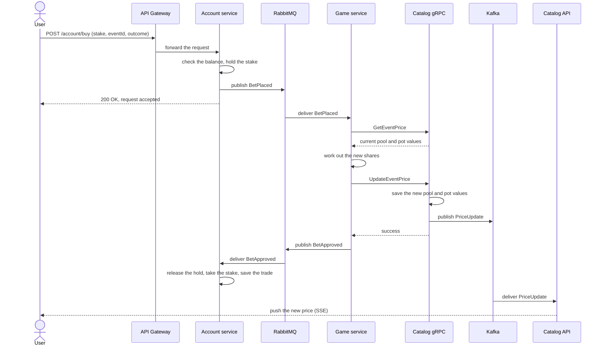

# Buy flow

A user buys shares in an event outcome. The trade is not instant. The
Account service accepts the order right away, and the trade settles a short
time later.

## Steps in plain words

1. The user sends a buy order: a stake amount, the event ID, and the outcome
   (Yes or No).
2. The Account service checks the user has enough funds. It holds the stake
   so the user cannot spend it twice.
3. The Account service puts the order on a queue and tells the user the
   order is accepted. The user does not wait for the trade to settle.
4. The Game service reads the order from the queue.
5. The Game service asks the Catalog gRPC service for the current price
   pools of the event.
6. The Game service works out the number of shares the stake buys.
7. The Game service sends the new pool values back to the Catalog gRPC
   service. The Catalog gRPC service saves them and announces the new price.
8. The Game service tells the Account service the trade is approved.
9. The Account service takes the held stake and adds the new shares to the
   user's trade history.
10. The Catalog API picks up the new price and sends it to the app.

See [system-overview.md](system-overview.md) for how the services connect.
