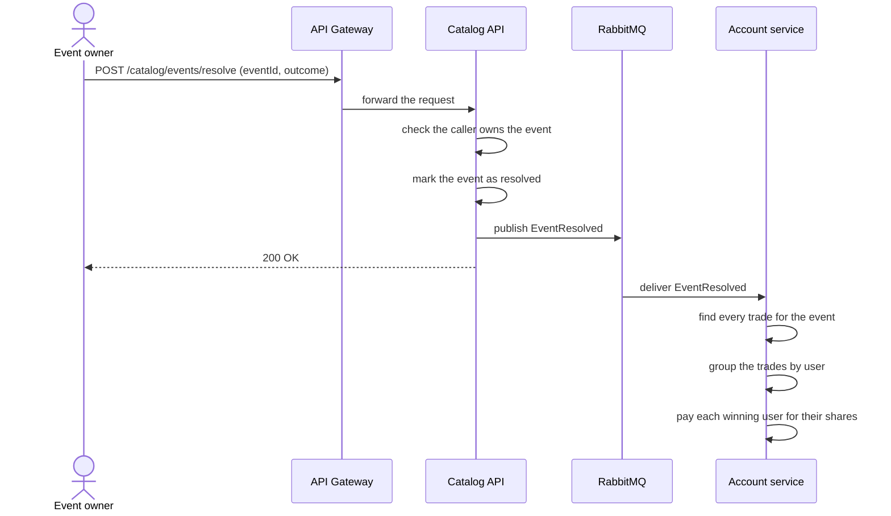

# Resolve flow

The event owner closes an event and sets the final outcome. This flow pays
out every winning trade.

## Steps in plain words

1. The event owner sends the final outcome: Yes or No.
2. The Catalog API checks the caller is the owner of the event. Only the
   owner can resolve it.
3. The Catalog API marks the event as resolved, so no more trades can happen
   on it.
4. The Catalog API puts a message on a queue and tells the owner the event
   is resolved.
5. The Account service reads the message from the queue.
6. The Account service finds every buy and sell trade made on that event.
7. The Account service works out the net shares each user holds in the
   winning outcome.
8. The Account service pays each of those users. One winning share pays out
   one unit of credit.

See [system-overview.md](system-overview.md) for how the services connect.
