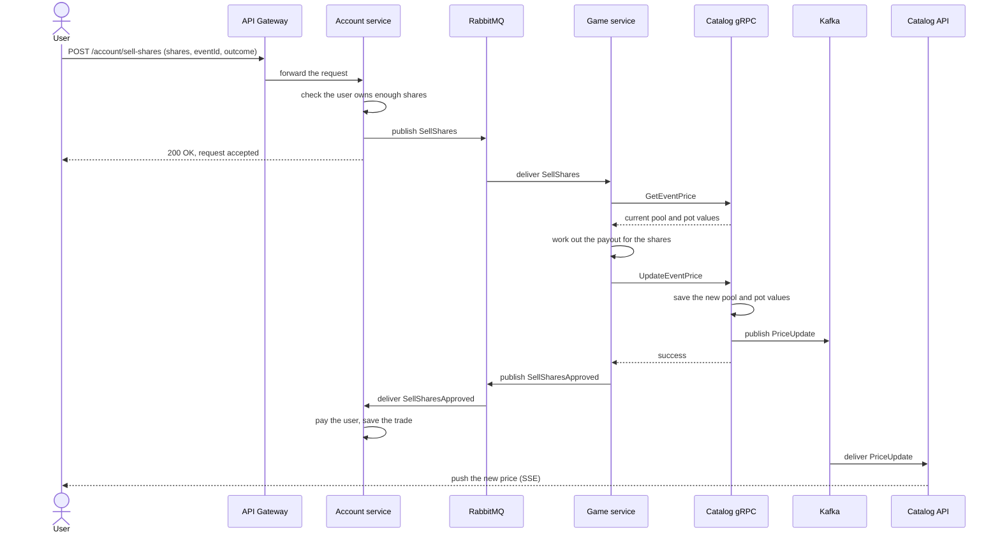

# Sell flow

A user sells shares they already own. The flow is close to the buy flow, but
money moves the other way: the user gets paid instead of paying.

## Steps in plain words

1. The user sends a sell order: the number of shares, the event ID, and the
   outcome (Yes or No).
2. The Account service checks the user's trade history. It confirms the user
   still holds that many shares in that outcome.
3. The Account service puts the order on a queue and tells the user the
   order is accepted. The user does not wait for the trade to settle.
4. The Game service reads the order from the queue.
5. The Game service asks the Catalog gRPC service for the current price
   pools of the event.
6. The Game service works out the payout for the shares.
7. The Game service sends the new pool values back to the Catalog gRPC
   service. The Catalog gRPC service saves them and announces the new price.
8. The Game service tells the Account service the sale is approved.
9. The Account service pays the payout into the user's wallet and records
   the sale in the trade history.
10. The Catalog API picks up the new price and sends it to the app.

See [mainDiagram.png](mainDiagram.png) for how the services connect.
