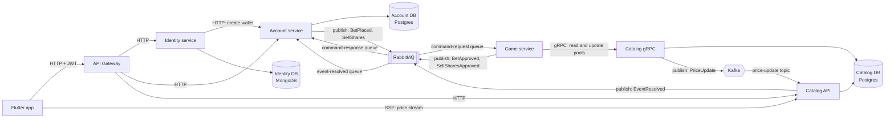

# System overview

This diagram shows the services in Eventus. It shows how each service talks to
the others, and which protocol it uses.

## Services

- **API Gateway.** The single entry point for the app. It sends each request
  to the right service.
- **Identity service.** Handles user sign-up and login. It stores users in
  MongoDB. When a user registers, it asks the Account service to open a
  wallet for that user.
- **Account service.** Holds user wallets and trade history in Postgres. It
  starts a buy or a sell by sending a message. It finishes the trade when it
  gets an answer back.
- **Game service.** Runs the market math. It reads and updates the price of
  an event through the Catalog gRPC service, then reports the result back to
  the Account service.
- **Catalog API.** Stores events (markets) in Postgres. Event owners create
  and resolve events here. It also streams live prices to the app over
  Server-Sent Events (SSE).
- **Catalog gRPC.** A second entry point to the same Catalog database. Only
  the Game service calls it. It is the only service allowed to change the
  price pools, and it announces every price change.
- **RabbitMQ.** Carries trade commands and their results between the Account
  service and the Game service. It also carries the event-resolved message
  from Catalog to Account.
- **Kafka.** Carries price updates from the Catalog gRPC service to the
  Catalog API, so the app can show live prices.

## Why two ways into Catalog

The Catalog API handles requests from users, through the gateway. The Catalog
gRPC service handles requests from the Game service only. Both use the same
database. This keeps user traffic and trade-engine traffic apart.
